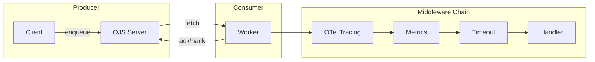
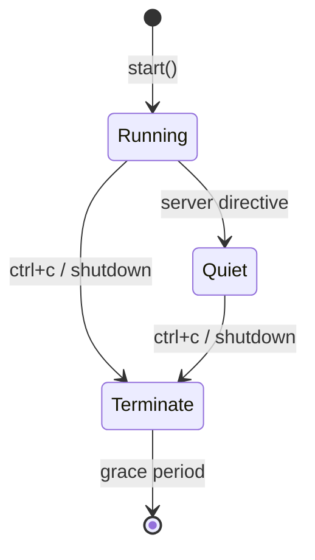

# ojs - Open Job Spec SDK for Rust

[](https://github.com/openjobspec/ojs-rust-sdk/actions/workflows/ci.yml)
[](https://crates.io/crates/ojs)
[](https://docs.rs/ojs)
[](LICENSE)
[](https://blog.rust-lang.org/2023/12/28/Rust-1.75.0.html)

The official Rust SDK for the [Open Job Spec](https://openjobspec.org) (OJS) protocol. OJS is a language-agnostic specification for background job processing, providing interoperability across languages and backends.

## Features

- **Async-first** - Built on `tokio` for high-performance async I/O
- **Type-safe** - Strong typing with `serde` serialization/deserialization
- **Typed handlers** - Generic `register_typed::<T>()` for compile-time arg safety
- **Middleware** - Tower-inspired middleware chain for cross-cutting concerns (logging, tracing, metrics, OpenTelemetry)
- **Workflows** - Chain, group, and batch workflow primitives
- **Builder pattern** - Ergonomic client and worker configuration
- **Full OJS compliance** - Implements OJS v1.0.0-rc.1 specification

## Installation

Add to your `Cargo.toml`:

```toml
[dependencies]
ojs = "0.1"
tokio = { version = "1", features = ["full"] }
serde_json = "1"
```

## Quick Start

### Enqueuing Jobs (Producer)

```rust
use ojs::{Client, RetryPolicy};
use serde_json::json;
use std::time::Duration;

#[tokio::main]
async fn main() -> ojs::Result<()> {
    let client = Client::builder()
        .url("http://localhost:8080")
        .build()?;

    // Simple enqueue
    let job = client
        .enqueue("email.send", json!({"to": "user@example.com"}))
        .await?;

    // Enqueue with options
    let job = client
        .enqueue("report.generate", json!({"id": 42}))
        .queue("reports")
        .delay(Duration::from_secs(300))
        .retry(RetryPolicy::new().max_attempts(5))
        .send()
        .await?;

    Ok(())
}
```

### Processing Jobs (Consumer)

```rust
use ojs::{Worker, JobContext};
use serde_json::json;

#[tokio::main]
async fn main() -> ojs::Result<()> {
    let worker = Worker::builder()
        .url("http://localhost:8080")
        .queues(vec!["default", "email"])
        .concurrency(10)
        .build()?;

    worker.register("email.send", |ctx: JobContext| async move {
        let to: String = ctx.job.arg("to")?;
        // send the email...
        Ok(json!({"message_id": "msg_123"}))
    }).await;

    worker.start().await?;
    Ok(())
}
```

### Workflows

```rust
use ojs::{Client, chain, group, batch, Step, BatchCallbacks};
use serde_json::json;

#[tokio::main]
async fn main() -> ojs::Result<()> {
    let client = Client::builder()
        .url("http://localhost:8080")
        .build()?;

    // Chain: sequential execution (A -> B -> C)
    let workflow = client.create_workflow(
        chain(vec![
            Step::new("data.fetch", json!({"url": "https://api.example.com"})),
            Step::new("data.transform", json!({"format": "csv"})),
            Step::new("data.notify", json!({"channel": "slack"})),
        ]).name("ETL Pipeline")
    ).await?;

    // Group: parallel execution
    let workflow = client.create_workflow(
        group(vec![
            Step::new("export.csv", json!({"id": 1})),
            Step::new("export.pdf", json!({"id": 1})),
        ])
    ).await?;

    // Batch: parallel with callbacks
    let workflow = client.create_workflow(
        batch(
            BatchCallbacks::new()
                .on_complete(Step::new("report", json!({}))),
            vec![
                Step::new("email.send", json!({"to": "a@b.com"})),
                Step::new("email.send", json!({"to": "c@d.com"})),
            ],
        )
    ).await?;

    Ok(())
}
```

### Middleware

```rust
use ojs::{Worker, Middleware, Next, JobContext, BoxFuture, HandlerResult};

struct LoggingMiddleware;

impl Middleware for LoggingMiddleware {
    fn handle(&self, ctx: JobContext, next: Next) -> BoxFuture<'static, HandlerResult> {
        Box::pin(async move {
            let start = std::time::Instant::now();
            let result = next.run(ctx).await;
            println!("Job processed in {:?}", start.elapsed());
            result
        })
    }
}

#[tokio::main]
async fn main() -> ojs::Result<()> {
    let worker = Worker::builder()
        .url("http://localhost:8080")
        .build()?;

    worker.use_middleware("logging", LoggingMiddleware).await;
    // register handlers...
    worker.start().await
}
```

### Typed Handlers

Auto-deserialize job args with compile-time type safety:

```rust
use ojs::{Worker, JobContext};
use serde::Deserialize;
use serde_json::json;

#[derive(Deserialize)]
struct EmailArgs {
    to: String,
    subject: String,
}

#[tokio::main]
async fn main() -> ojs::Result<()> {
    let worker = Worker::builder()
        .url("http://localhost:8080")
        .build()?;

    // Type-safe: args auto-deserialized via serde
    worker.register_typed("email.send", |ctx: JobContext, args: EmailArgs| async move {
        println!("Sending to {}: {}", args.to, args.subject);
        Ok(json!({"status": "sent"}))
    }).await;

    worker.start().await
}
```

### OpenTelemetry Integration

Native OTel tracing and metrics (enable `otel-middleware` feature):

```toml
[dependencies]
ojs = { version = "0.1", features = ["otel-middleware"] }
```

```rust
use ojs::otel::{OtelTracingMiddleware, OtelMetricsMiddleware};

// Uses global OTel providers by default
worker.use_middleware("otel-tracing", OtelTracingMiddleware::new()).await;
worker.use_middleware("otel-metrics", OtelMetricsMiddleware::new()).await;
```

Recorded spans: `ojs.job {type}` with attributes `ojs.job.type`, `ojs.job.id`, `ojs.job.queue`, `ojs.job.attempt`.
Recorded metrics: `ojs.job.started`, `ojs.job.completed`, `ojs.job.failed` (counters), `ojs.job.duration` (histogram).

## Architecture





## API Reference

### Client

| Method | Description |
|--------|-------------|
| `enqueue(type, args)` | Enqueue a single job |
| `enqueue_batch(requests)` | Atomically enqueue multiple jobs |
| `get_job(id)` | Get job details |
| `cancel_job(id)` | Cancel a job |
| `create_workflow(def)` | Create a workflow |
| `get_workflow(id)` | Get workflow status |
| `cancel_workflow(id)` | Cancel a workflow |
| `list_queues()` | List all queues |
| `get_queue_stats(name)` | Get queue statistics |
| `pause_queue(name)` | Pause a queue |
| `resume_queue(name)` | Resume a queue |
| `list_dead_letter_jobs(...)` | List dead letter jobs |
| `retry_dead_letter_job(id)` | Retry a dead letter job |
| `list_cron_jobs()` | List cron jobs |
| `register_cron_job(req)` | Register a cron job |
| `health()` | Server health check |
| `manifest()` | Server conformance manifest |

### Worker

| Method | Description |
|--------|-------------|
| `register(type, handler)` | Register a job handler |
| `register_typed::<T>(type, handler)` | Register a typed handler with auto-deserialization |
| `use_middleware(name, mw)` | Add middleware |
| `start()` | Start processing (blocks until shutdown) |
| `state()` | Get current worker state |
| `id()` | Get worker ID |

## Feature Flags

| Feature | Description |
|---------|-------------|
| `reqwest-transport` | HTTP transport via reqwest (default) |
| `common-middleware` | Built-in logging, timeout, metrics middleware |
| `tracing-middleware` | Structured tracing spans via `tracing` crate |
| `otel-middleware` | Native OpenTelemetry tracing and metrics |
| `testing` | Test utilities and mock builders |

## MSRV

The minimum supported Rust version is **1.75**.

## License

Apache-2.0
