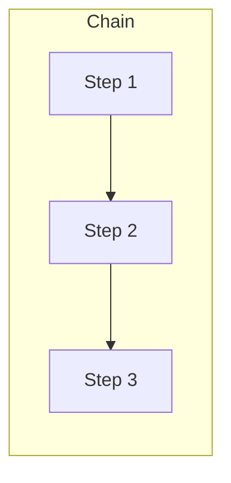
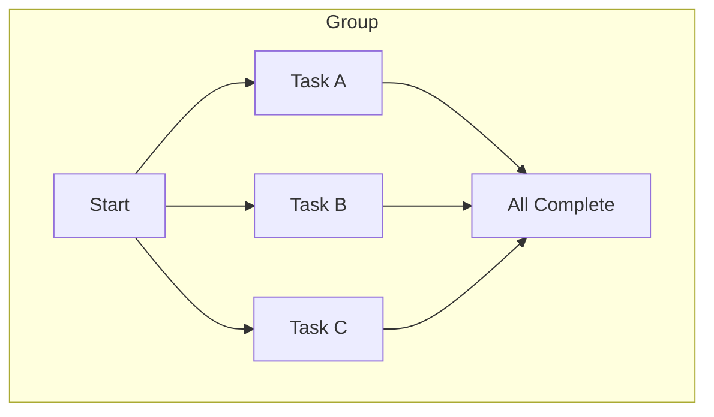
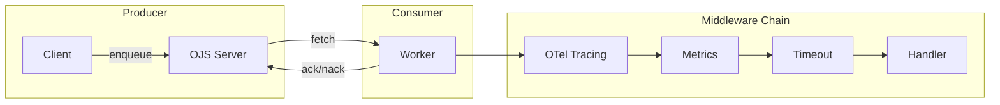
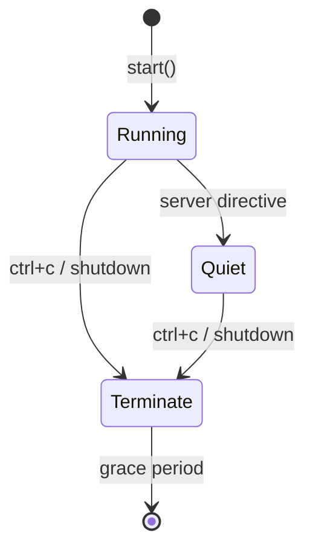

# ojs - Open Job Spec SDK for Rust


[](https://github.com/openjobspec/ojs-rust-sdk/actions/workflows/ci.yml)
[](https://crates.io/crates/ojs)
[](https://docs.rs/ojs)
[](LICENSE)
[](https://blog.rust-lang.org/2023/12/28/Rust-1.75.0.html)

The official Rust SDK for the [Open Job Spec](https://openjobspec.org) (OJS) protocol. OJS is a language-agnostic specification for background job processing, providing interoperability across languages and backends.

> **🚀 Try it now:** [Open in Playground](https://playground.openjobspec.org?lang=rust) · [Run on CodeSandbox](https://codesandbox.io/p/sandbox/openjobspec-rust-quickstart)

## Features

- **Async-first** - Built on `tokio` for high-performance async I/O
- **Type-safe** - Strong typing with `serde` serialization/deserialization
- **Typed handlers** - Generic `register_typed::<T>()` for compile-time arg safety
- **Middleware** - Tower-inspired middleware chain for cross-cutting concerns (logging, tracing, metrics, OpenTelemetry)
- **Workflows** - Chain, group, and batch workflow primitives
- **Builder pattern** - Ergonomic client and worker configuration
- **Full OJS compliance** - Implements OJS v1.0 specification

## Installation

Add to your `Cargo.toml`:

```toml
[dependencies]
ojs = "0.5.0"
tokio = { version = "1", features = ["full"] }
serde_json = "1"
```

## Quick Start

### Enqueuing Jobs (Producer)

```rust
use ojs::{Client, RetryPolicy};
use serde_json::json;
use std::time::Duration;

#[tokio::main]
async fn main() -> ojs::Result<()> {
    let client = Client::builder()
        .url("http://localhost:8080")
        .build()?;

    // Simple enqueue
    let job = client
        .enqueue("email.send", json!({"to": "user@example.com"}))
        .await?;

    // Enqueue with options
    let job = client
        .enqueue("report.generate", json!({"id": 42}))
        .queue("reports")
        .delay(Duration::from_secs(300))
        .retry(RetryPolicy::new().max_attempts(5))
        .send()
        .await?;

    Ok(())
}
```

### Processing Jobs (Consumer)

```rust
use ojs::{Worker, JobContext};
use serde_json::json;

#[tokio::main]
async fn main() -> ojs::Result<()> {
    let worker = Worker::builder()
        .url("http://localhost:8080")
        .queues(vec!["default", "email"])
        .concurrency(10)
        .build()?;

    worker.register("email.send", |ctx: JobContext| async move {
        let to: String = ctx.job.arg("to")?;
        // send the email...
        Ok(json!({"message_id": "msg_123"}))
    }).await;

    worker.start().await?;
    Ok(())
}
```

### Workflows

OJS provides three workflow primitives — **chain** (sequential), **group** (parallel fan-out/fan-in), and **batch** (parallel with callbacks):


```mermaid
graph LR
    subgraph Chain
    A1[Step 1] --> A2[Step 2] --> A3[Step 3]
    end
```

```mermaid
graph TD
    subgraph Group
    S[Start] --> G1[Task A] & G2[Task B] & G3[Task C] --> J[All Complete]
    end
```

```rust
use ojs::{Client, chain, group, batch, Step, BatchCallbacks};
use serde_json::json;

#[tokio::main]
async fn main() -> ojs::Result<()> {
    let client = Client::builder()
        .url("http://localhost:8080")
        .build()?;

    // Chain: sequential execution (A -> B -> C)
    let workflow = client.create_workflow(
        chain(vec![
            Step::new("data.fetch", json!({"url": "https://api.example.com"})),
            Step::new("data.transform", json!({"format": "csv"})),
            Step::new("data.notify", json!({"channel": "slack"})),
        ]).name("ETL Pipeline")
    ).await?;

    // Group: parallel execution
    let workflow = client.create_workflow(
        group(vec![
            Step::new("export.csv", json!({"id": 1})),
            Step::new("export.pdf", json!({"id": 1})),
        ])
    ).await?;

    // Batch: parallel with callbacks
    let workflow = client.create_workflow(
        batch(
            BatchCallbacks::new()
                .on_complete(Step::new("report", json!({}))),
            vec![
                Step::new("email.send", json!({"to": "a@b.com"})),
                Step::new("email.send", json!({"to": "c@d.com"})),
            ],
        )
    ).await?;

    Ok(())
}
```

Workflow-level options added with `WorkflowDefinition::with_option()` are
validated locally before step and callback options. Defaults are materialized
into each job, while a step-level option overrides the corresponding valid
default; an invalid default is never hidden by an override.

### Middleware

```rust
use ojs::{Worker, Middleware, Next, JobContext, BoxFuture, HandlerResult};

struct LoggingMiddleware;

impl Middleware for LoggingMiddleware {
    fn handle(&self, ctx: JobContext, next: Next) -> BoxFuture<'static, HandlerResult> {
        Box::pin(async move {
            let start = std::time::Instant::now();
            let result = next.run(ctx).await;
            println!("Job processed in {:?}", start.elapsed());
            result
        })
    }
}

#[tokio::main]
async fn main() -> ojs::Result<()> {
    let worker = Worker::builder()
        .url("http://localhost:8080")
        .build()?;

    worker.use_middleware("logging", LoggingMiddleware).await;
    // register handlers...
    worker.start().await
}
```

### Typed Handlers

Auto-deserialize job args with compile-time type safety:

```rust
use ojs::{Worker, JobContext};
use serde::Deserialize;
use serde_json::json;

#[derive(Deserialize)]
struct EmailArgs {
    to: String,
    subject: String,
}

#[tokio::main]
async fn main() -> ojs::Result<()> {
    let worker = Worker::builder()
        .url("http://localhost:8080")
        .build()?;

    // Type-safe: args auto-deserialized via serde
    worker.register_typed("email.send", |ctx: JobContext, args: EmailArgs| async move {
        println!("Sending to {}: {}", args.to, args.subject);
        Ok(json!({"status": "sent"}))
    }).await;

    worker.start().await
}
```

### OpenTelemetry Integration

Native OTel tracing and metrics (enable `otel-middleware` feature):

```toml
[dependencies]
ojs = { version = "0.3", features = ["otel-middleware"] }
```

```rust
use ojs::otel::{OtelTracingMiddleware, OtelMetricsMiddleware};

// Uses global OTel providers by default
worker.use_middleware("otel-tracing", OtelTracingMiddleware::new()).await;
worker.use_middleware("otel-metrics", OtelMetricsMiddleware::new()).await;
```

Recorded spans: `ojs.job {type}` with attributes `ojs.job.type`, `ojs.job.id`, `ojs.job.queue`, `ojs.job.attempt`.
Recorded metrics: `ojs.job.started`, `ojs.job.completed`, `ojs.job.failed` (counters), `ojs.job.duration` (histogram).

## Architecture


```mermaid
graph LR
    subgraph Producer
        C[Client] -->|enqueue| S[OJS Server]
    end
    subgraph Consumer
        S -->|fetch| W[Worker]
        W -->|ack/nack| S
    end
    subgraph Middleware Chain
        W --> M1[OTel Tracing]
        M1 --> M2[Metrics]
        M2 --> M3[Timeout]
        M3 --> H[Handler]
    end
```


```mermaid
stateDiagram-v2
    [*] --> Running : start()
    Running --> Quiet : server directive
    Running --> Terminate : ctrl+c / shutdown
    Quiet --> Terminate : ctrl+c / shutdown
    Terminate --> [*] : grace period
```

## API Reference

### Client

| Method | Description |
|--------|-------------|
| `enqueue(type, args)` | Enqueue a single job |
| `enqueue_batch(requests)` | Atomically enqueue multiple jobs |
| `get_job(id)` | Get job details |
| `cancel_job(id)` | Cancel a job |
| `create_workflow(def)` | Create a workflow |
| `get_workflow(id)` | Get workflow status |
| `cancel_workflow(id)` | Cancel a workflow |
| `list_queues()` | List all queues |
| `get_queue_stats(name)` | Get queue statistics |
| `pause_queue(name)` | Pause a queue |
| `resume_queue(name)` | Resume a queue |
| `list_dead_letter_jobs(...)` | List dead letter jobs |
| `retry_dead_letter_job(id)` | Retry a dead letter job |
| `list_cron_jobs()` | List cron jobs |
| `register_cron_job(req)` | Register a cron job |
| `health()` | Server health check |
| `manifest()` | Server conformance manifest |

### Worker

| Method | Description |
|--------|-------------|
| `register(type, handler)` | Register a job handler |
| `register_typed::<T>(type, handler)` | Register a typed handler with auto-deserialization |
| `use_middleware(name, mw)` | Add middleware |
| `start()` | Start processing (blocks until shutdown) |
| `shutdown()` | Request a graceful drain, even before `start()` begins |
| `state()` | Get current worker state |
| `id()` | Get worker ID |

`shutdown()` is latched before startup, so a pre-start shutdown prevents the
worker from ever fetching jobs. If the grace period expires, the worker first
decides every remaining job's fate atomically -- claiming terminal reporting
for jobs that never started an ACK/NACK and starting their bounded forced
NACKs immediately -- and only then aborts handler execution and heartbeat
work. An ACK/NACK that was *already in flight* is not cancelled with its
handler: it keeps running and is awaited for up to three seconds, and only a
report that still has not settled is cancelled and replaced by a single
forced NACK. Every terminal report a job receives is therefore exactly one,
and all of this work shares one absolute five-second deadline, so
blocking/CPU-bound handlers can neither suppress release attempts nor hold
`start()` open indefinitely; a handler that later resumes cannot ACK/NACK
after the forced claim.
If a shutdown-owned forced NACK fails or reaches the absolute deadline, its
claim remains exclusive because the request may already have reached the
server; a late handler is therefore still prevented from sending a duplicate
terminal report.

## Real-Time Subscriptions

Subscribe to job state changes via Server-Sent Events (SSE):

```rust
use ojs::subscribe::{subscribe, subscribe_job, subscribe_queue, SubscribeOptions};

// Subscribe to all events for a queue
let mut stream = subscribe(SubscribeOptions {
    url: "http://localhost:8080".to_string(),
    channel: "queue:default".to_string(),
    auth: None,
}).await?;

while let Some(event) = stream.recv().await {
    println!("{}: {}", event.event_type, event.data);
}

// Subscribe to a specific job
let mut job_stream = subscribe_job("http://localhost:8080", &job_id, None).await?;

// Subscribe to a queue
let mut queue_stream = subscribe_queue("http://localhost:8080", "emails", None).await?;
```

Only `200 OK` plus `Content-Type: text/event-stream` starts a stream. `204`
closes the receiver without reconnecting, permanent `4xx` responses stop the
subscription, and transient failures reconnect with bounded backoff and
`Last-Event-ID` resumption. Dropping the receiver promptly cancels an idle
stream, reconnect backoff, or an in-flight reconnect request. An explicit
empty SSE `id:` clears the stored ID, so the next reconnect omits
`Last-Event-ID`.

The parser accumulates raw transport bytes and only UTF-8 decodes *complete*
field lines (split on the newline byte, with a trailing `\r` stripped), so a
multibyte character split across chunks -- including one byte per chunk -- is
never corrupted. Decoding is strict: a line that is not valid UTF-8 ends the
current connection with a controlled error and reconnects (bounded backoff)
rather than emitting U+FFFD replacement characters or panicking.

## Serverless HTTP Push

For AWS Lambda push delivery, keep the legacy
`register(ctx, job)`/`handle_http()` path for trusted upstreams, or use
`register_with_context()` plus `handle_http_authenticated()` when your function
URL is exposed directly:

```rust
use ojs::serverless::{LambdaHandler, PushAuthConfig, PushContext};

let mut handler = LambdaHandler::new()
    .try_with_push_auth(
        PushAuthConfig::new()
            .try_with_signing_secret_from_env("OJS_PUSH_SIGNING_SECRET")?
    )?;

handler.register_with_context("email.send", |ctx: PushContext| async move {
    println!(
        "job={} worker={:?} delivery={:?}",
        ctx.job().id,
        ctx.worker_id(),
        ctx.delivery_id(),
    );
    Ok(())
});
```

Authenticated push requires a non-empty `delivery_id`, validates forwarded
`X-OJS-Delivery-ID`/`X-OJS-Job-ID` headers against the signed body when
present, and suppresses replayed delivery IDs within the configured freshness
window. Signing secrets must be randomly generated and at least 32 bytes
(256 bits); missing, empty, short, or mixed-invalid rotation lists fail
closed. Prefer `try_with_signing_secret_from_env()` plus
`try_with_push_auth()` so configuration errors surface during Lambda
initialization.

The default replay store is bounded and shared by all `LambdaHandler`
instances in one process. It never evicts unexpired delivery IDs and fails
retryably when full. In production, configure
`with_delivery_id_store(Arc<dyn DeliveryIdStore>)` with an atomic TTL-backed
DynamoDB or Redis implementation: process memory cannot guarantee
deduplication across separate Lambda execution environments.

## Secret-Safe `Debug`

Types that carry credentials implement `Debug` manually so secrets never reach
logs or panic messages. `AgentClient` and `ConnectionConfig` redact their
bearer `auth_token` (showing only presence), `PushAuthConfig` shows only the
*count* of configured signing secrets (never the bytes), and the default HTTP
transport redacts both the bearer token and custom header *values* (rendering
only header names). Because `Client`/`Worker` hold the transport, this also
prevents `format!("{client:?}")` from recursively leaking the token.

## Queue Names & Job Types

Queue names and job types are validated locally before any request is sent.
Length limits are enforced in **UTF-8 bytes** (not Unicode scalar count): a
queue name or job type must not exceed **255 bytes**, matching the OJS spec
(`ojs-payload-limits.md`, `SEC-010` pattern `^[a-zA-Z0-9_.-]{1,255}$`). The
byte-length check runs before pattern validation, so an oversized multibyte
value is rejected on length grounds regardless of its characters. The same
validation runs for direct enqueue, workflow steps, workflow-level defaults,
and batch callbacks.

## Feature Flags

| Feature | Description |
|---------|-------------|
| `reqwest-transport` | HTTP transport via reqwest (default) |
| `common-middleware` | Built-in logging, timeout, metrics middleware |
| `tracing-middleware` | Structured tracing spans via `tracing` crate |
| `otel-middleware` | Native OpenTelemetry tracing and metrics |
| `testing` | Test utilities and mock builders |

## MSRV

The minimum supported Rust version is **1.75**.

## License

Apache-2.0
